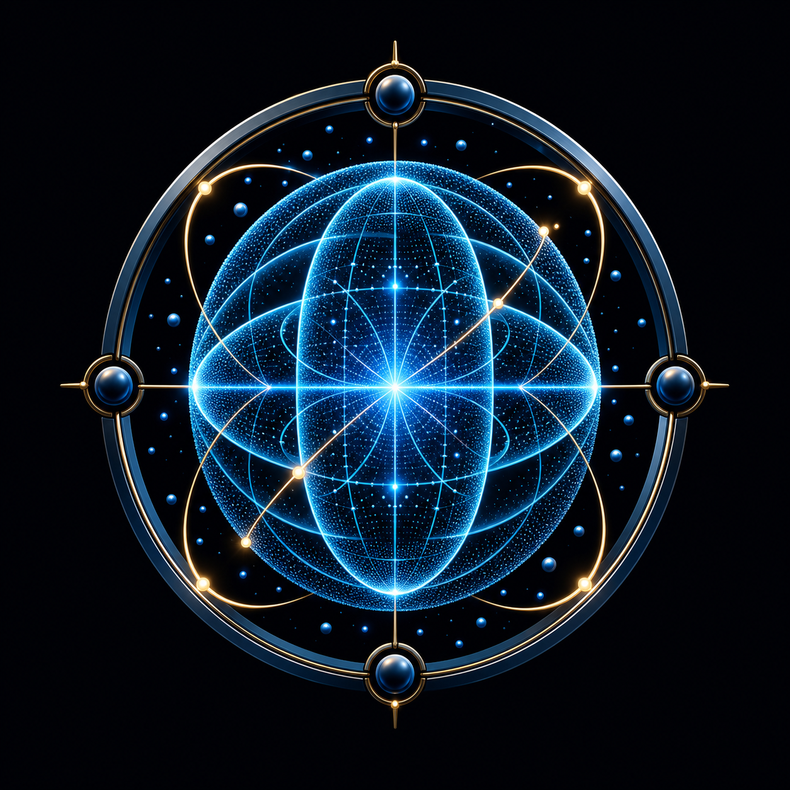

# Matter Frontier Lab

<p align="center">
  
</p>

**Matter Frontier Lab** is a local-first interactive laboratory for exploring particle physics, dense and exotic matter, collider events, macro-objects, neutrino communication, and educational 4D projections.

It is a visual and computational education project. It clearly distinguishes experimental facts, published theoretical models, catalogue-only entries, and author-defined hypotheses. It is **not** a tool for predicting new particles, designing a neutrino communication device, or replacing validated research pipelines.

## What the laboratory includes

- A multilingual catalogue (English by default, Russian and Hebrew selectable) covering ordinary particles, antiparticles, nuclei, dense/QCD matter, mesons, exotic-matter taxonomy, and macro-objects.
- Interactive 3D views built with Three.js: quark structure, meson string breaking, confinement, particle/antiparticle annihilation, collider event displays, and conceptual field visualisations.
- A dedicated **Neutrino Communication Lab** inside the Neutrino Lens hypothesis. It compares a photon/EM channel and a neutrino-beam channel crossing rock, with message-to-bits-to-received-message demonstration controls.
- A collider workbench with transparent detector layers, speed/pause controls, configurable beams, and explanatory event summaries.
- Macro-object scenes for the Sun, Jupiter, black holes, neutron stars, and compact-object catalogue entries.
- An orbitable WebGL black-hole view with a lensed accretion disk, photon-ring-inspired features, and a merger-laboratory mode for two or three compact objects. The merger mode is explicitly educational: it visualises an analytic/qualitative inspiral, curvature embedding and gravitational-wave fronts, rather than a numerical-relativity prediction.
- A project-hypothesis workspace for a 4D complex-spin quasiparticle, including 3D slices, a tesseract projection, sparse 3D M-field regions, and ordinary-3D probe demonstrations.
- Per-model scientific notes, equations, scope limitations, and source links.

## Run locally

```powershell
python server.py --port 8892
```

Then open `http://127.0.0.1:8892/` in the same computer's browser. `127.0.0.1` is the standard loopback address: it never reveals an external IP address and is not reachable from the internet.

On Windows, `start_qcd_neutrino_lab.bat` starts the local server. The `matter-lab/Start-MatterFrontierLab.ps1` and `matter-lab/Matter Frontier Lab Autostart.cmd` helpers are provided for a persistent per-user sign-in launch. They keep restarting the local Python server if it exits.

## Technology

- Vanilla JavaScript, HTML and CSS.
- [Three.js](https://threejs.org/) for the real-time 3D scenes, controls and glTF/USDZ loading.
- A small Python standard-library HTTP server and local educational solver API.
- Local glTF/USDZ/image assets for selected macro-object visualisations.

## Open resources and scientific software

The project uses and documents open resources in three distinct ways.

### Directly included or used by the application

- [Three.js](https://github.com/mrdoob/three.js) is loaded as the browser 3D framework.
- NASA public 3D/visual resources are used or referenced for selected Sun, Jupiter and black-hole/macro-object presentations. Asset provenance is retained in catalogue source links; NASA material remains subject to NASA media-use guidance.

### Linked research software and data pathways

These are **not bundled or executed in the browser**. The catalogue links to them and the architecture leaves room for traceable adapters:

- [PYTHIA 8](https://pythia.org/) for event generation and Lund string fragmentation.
- [HepMC3](https://gitlab.cern.ch/hepmc/HepMC3) as an event-record interchange layer.
- [Geant4](https://geant4.web.cern.ch/) for particle transport and detector response.
- [nuSQuIDS](https://github.com/arguelles/nuSQuIDS) for neutrino propagation calculations.
- [MUSES](https://musesframework.io/) and [CompOSE](https://compose.obspm.fr/) for dense-matter equations of state.
- [MEEP](https://github.com/NanoComp/meep), [Einstein Toolkit](https://einsteintoolkit.org/), [GADGET-4](https://wwwmpa.mpa-garching.mpg.de/gadget4/), [CosmoLattice](https://cosmolattice.net/) and [AxionCAMB](https://github.com/dgrin1/axionCAMB) as referenced open simulation ecosystems for specialised catalogue topics.
- [Eric Bruneton's open black-hole shader](https://github.com/ebruneton/black_hole_shader) and its accompanying [technical paper](https://ebruneton.github.io/black_hole_shader/paper.pdf) as a reference for real-time Schwarzschild-inspired ray-bending visuals. It is not the non-public renderer used for *Interstellar* and does not replace numerical relativity.
- [NASA 3D Resources](https://github.com/nasa/NASA-3D-Resources) and the NASA resource pages linked from individual model cards.

The browser scenes are deliberately lightweight educational representations. They must not be presented as results produced by those upstream research packages.

## Future direction: reproducible and cloud-quantum-assisted studies

The proposed roadmap is a staged, reproducible workflow:

1. Export each interactive preset to a versioned parameter record.
2. Evaluate candidate models first with classical open solvers and constrained numerical optimisation.
3. Use cloud quantum resources only for well-defined, small subproblems — for example variational ground-state estimates, constrained spin/lattice toy Hamiltonians, or quantum-inspired sampling benchmarks.
4. Compare every quantum result against classical baselines, uncertainty estimates and known physical constraints before ranking a hypothesis.
5. Record provider, backend, circuit/algorithm version, noise-mitigation strategy, shots, seeds and raw outputs so results can be reproduced.

This could eventually connect the lab to cloud platforms such as IBM Quantum, Azure Quantum or Amazon Braket through dedicated server-side adapters. Such integration would be exploratory: a cloud quantum result can help search a toy-model parameter space, but cannot by itself establish that a hypothetical form of matter is stable or physically real. Stability claims would still require validated effective theories, classical convergence checks, phenomenological constraints and, ultimately, experiment.

## Repository structure

```text
matter-lab/               Main Matter Frontier Lab interface and 3D scenes
neutrino-communication/   Standalone precursor communication visualisation
server.py                 Local HTTP server and educational solver API
index.html                Local portal page
start_qcd_neutrino_lab.bat
```

## Scientific and safety note

The words *hypothesis*, *theoretical*, and *catalogue-only* in the interface are intentional. A model may be visually compelling while still being unconfirmed, incomplete, or purely educational. Links in the catalogue are provided for further study and provenance, not as an assertion that the linked software validates the displayed hypothesis.

## License

Unless an individual file or imported asset specifies otherwise, the original code in this repository is released under the MIT License. Third-party software, papers, data and visual assets retain their own licences and attribution requirements; see [NOTICE.md](NOTICE.md).
